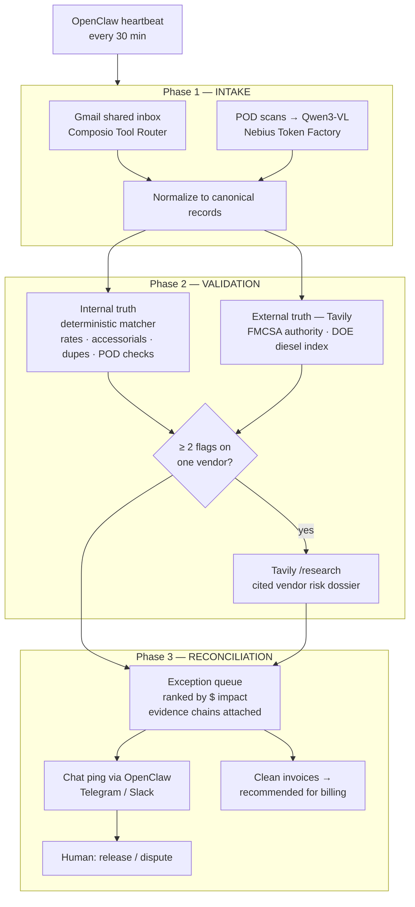

# Architecture

## Design principle

**Deterministic money math, probabilistic perception, human judgment.** Three layers, strictly separated:

1. Anything that computes dollars (matching, tolerances, FSC math) is plain tested Python. No LLM. Reproducible.
2. Anything that reads the messy physical world (POD scans) or the open web (carrier records, fuel indexes) is a model or search call — always with a confidence score and an evidence citation attached.
3. Anything that *decides* — release, dispute, eat the cost — is a human. The agent assembles the case; it never moves money.

## The three-phase state machine

## Module map

| Path | Phase | Notes |
|---|---|---|
| `stowaway/intake.py` | 1 | Fixture loader (replay) + Composio/VLM live stubs |
| `stowaway/models.py` | — | Canonical records, flags, evidence. Integer cents everywhere |
| `stowaway/matcher.py` | 2a | Internal truth. Deterministic, tested, tolerance-driven |
| `stowaway/truth.py` | 2b | External truth via Tavily. FMCSA, DOE, `/research` dossiers |
| `stowaway/reconcile.py` | 3 | Ranking, evidence rendering, chat ping |
| `stowaway/replay.py` | — | Record/replay for every external call |
| `stowaway/cli.py` | — | The loop. Same entrypoint for `make demo` and the OpenClaw skill |

## Why record/replay is load-bearing

Every external dependency records its responses as JSON fixtures in live mode and replays them otherwise. Consequences:

- `make demo` runs the **identical code path** as production with zero keys and zero packages — the demo cannot break because an API is down or a key expired.
- Fixtures are committed, so the end-to-end test (`tests/test_pipeline.py`) pins the full pipeline against `data/answer_key.json`: all 15 planted frauds found, zero false positives on 36 clean invoices.
- A replay miss raises loudly (`ReplayMissError`) instead of silently passing an invoice — an audit tool must fail closed.

## Failure modes we handle on purpose

- **Tavily stale/cached URLs** → HEAD-check before extract; degrade from advanced to basic depth on timeout (p95 on advanced is seconds, not ms).
- **SAFER has no clean public API** → search + extract is heuristic; confidence scores are honest about it, and identity flags are CRITICAL precisely so a human always looks.
- **Vision misreads** → POD legibility is advisory; it can hold an invoice, never clear one alone.
- **Dossier failure** → logged and skipped; the underlying flags still route. Escalation is enrichment, not a dependency.

## What we'd build next

Per-contract FSC schedules; remit-to bank-change detection (the strongest double-brokering tell); two-directional leakage (charges *we* failed to bill); learning tolerance bands from historical clerk decisions.
