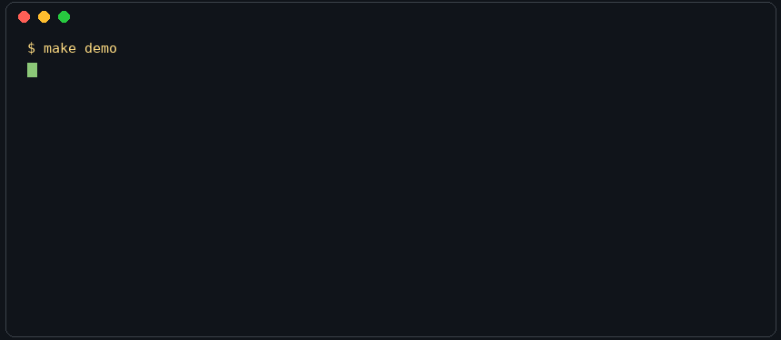

# ⚓ Stowaway

**Finds the charges hiding in your hull.**

An autonomous freight-audit agent that validates carrier invoices against **the live web as a source of truth** — phantom carriers, fuel surcharges computed off stale diesel prices, duplicate billings, illegible proof-of-delivery scans. It flags the money. It never moves it.



```
$ make demo        # zero API keys, zero dependencies, runs in <1 second

⚓ Stowaway audit · mode=replay
  intake        51 invoices · 55 loads · 50 PODs
  validation    16 flags across 15 invoices
  dossiers      1 vendor deep-dives (Tavily /research)
  reconcile     36 cleared · 15 exceptions

⚓ Stowaway: 51 invoices audited — 36 cleared, 15 need eyes.
💸 $4,751 recoverable, $24,846 held.
Worst: Bluewater Logistics LLC (INV-26036) — MC 998877 does not
exist in FMCSA records. Do not pay.
```

## The problem

It's 4:45 on a Friday at a 300-truck freight operation. The AP clerk has 200 carrier invoices in the queue. Every check is trivial — *does this carrier's MC number exist? was this fuel surcharge computed from this week's DOE diesel index? didn't we already pay this load?* At volume, trivial checks get skipped, and skipped checks always favor the carrier. Roughly **40% of freight invoices contain errors**; double-brokering fraud alone costs the industry hundreds of millions a year.

The deeper problem: **half the truth an invoice must match lives outside your four walls, and it changes weekly.** Your TMS knows what you agreed to. It does not know whether MC 998877 exists, what diesel cost on Monday, or that "Apex Freight Solutions" registered 11 weeks ago at a mailbox store in Doral, FL.

Every other agent searches the web to *write* something. Stowaway searches the web to **call bullshit**.

## How it works — three phases

```
INTAKE          Gmail shared inbox via Composio Tool Router → invoice + POD
                attachments → vision model on Nebius Token Factory reads the
                physical scans → canonical records, same shape every time

VALIDATION      internal truth:  deterministic line-level matching against the
                                 TMS — rates, tolerances, accessorials, dupes.
                                 No LLM in the money math. (tested)
                external truth:  Tavily → FMCSA carrier authority,
                                 DOE weekly diesel index, and /research
                                 dossiers on vendors that trip ≥2 flags

RECONCILIATION  exceptions ranked by dollar impact, each with an evidence
                chain (citations, computations, scan reads) → OpenClaw pings
                a human in chat. Clean invoices recommended for billing.
```

Runtime is **OpenClaw**: a heartbeat wakes the agent every 30 minutes, it audits whatever arrived, and it messages you in Telegram only when there's money on the table. See [`ARCHITECTURE.md`](ARCHITECTURE.md) for the full design and [`skill/SKILL.md`](skill/SKILL.md) for the agent wiring.

## Run it

```bash
make demo        # replay mode: full pipeline from committed fixtures.
                 # No keys. No pip install. Python 3.10+ stdlib only.
make test        # 26 tests, incl. end-to-end against data/answer_key.json
make demo-live   # real Tavily + Token Factory (cp .env.example .env first)
make data        # regenerate the synthetic dataset (deterministic, seed 1979)
```

Replay mode exists because every external call is wrapped in a record/replay layer (`stowaway/replay.py`). Live calls record fixtures; the demo replays them. The pipeline you see in replay is the same code path as production — only the truth source changes.

## The dataset

`data/` contains 51 synthetic invoices with **15 planted frauds** documented in [`data/answer_key.json`](data/answer_key.json): a phantom carrier, a revoked authority, a double-brokered load (real MC, wrong company), three stale fuel weeks, a duplicate billing, unauthorized and duplicated accessorials, linehaul padding, and three kinds of POD failure. `make test` proves the pipeline finds **all 15, with zero false positives on the 36 clean invoices.**

All data is synthetic. No real carriers, customers, or contracts. The PODs exist as actual scan images too (`data/pod_scans/`, rendered by `scripts/render_pods.py`) — signed delivery receipts with scanner noise, one missing its signature, one signed at the wrong consignee — so the vision layer reads real pixels, not pre-digested JSON.

See [`PITCH.md`](PITCH.md) for the 90-second pitch and [`DEMO.md`](DEMO.md) for the demo-video storyboard.

## Stack

| Layer | What it does here |
|---|---|
| **Tavily** | The external-truth layer: FMCSA SAFER lookups, DOE diesel index, `/research` risk dossiers with citations |
| **Composio** | Tool Router → Gmail shared-inbox intake, Slack exception routing. Least-privilege scopes only |
| **Nebius Token Factory** | All inference, open models only: Qwen3-VL reads POD scans, GPT-OSS-120B summarizes dossiers |
| **OpenClaw** | Runtime: heartbeat scheduling, chat-app interface, this repo's skill. Deploys to Nebius Serverless in one command |

## Limitations (honest ones)

- Live FMCSA parsing is heuristic — SAFER has no clean public API; we search + extract via Tavily and HEAD-check URLs before trusting them (Tavily's cached index can return stale links). Confidence scores reflect this.
- The FSC schedule is one contract's; production needs per-contract schedules.
- POD legibility scoring is a vision-model judgment, not ground truth — which is exactly why it routes to a human instead of auto-clearing.
- This audits; it does not pay, post to ledgers, or dispute on its own. By design.

## Security posture

No third-party ClawHub skills (we wrote our own — see `skill/`). Docker sandbox + tool allowlist in the OpenClaw config. Composio scopes are minimal (`gmail.readonly`, `chat:write`). Keys live in `.env`, never in code or fixtures.

---

*Built for [BuilderShip](https://ship.builders) by a team that runs its actual AP ops on OpenClaw. Stowaway flags the money. It never moves it.*
